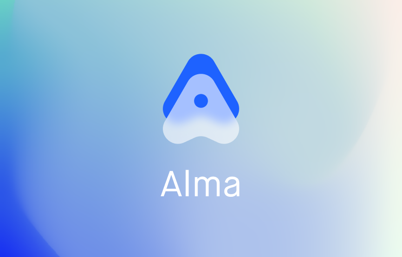
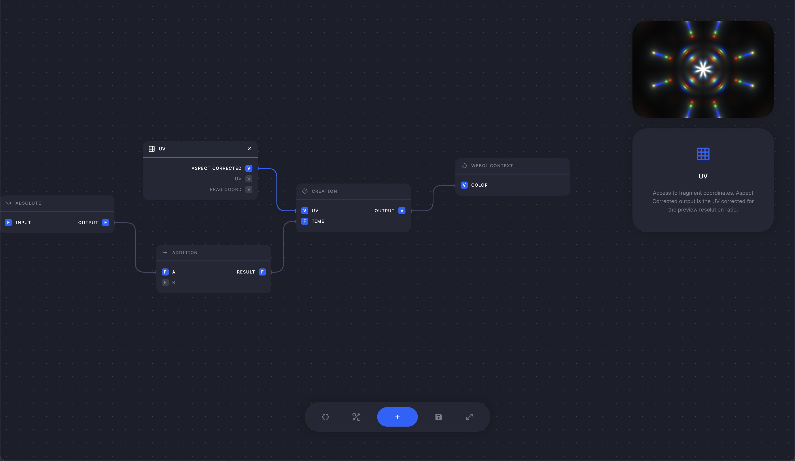

# Alma

Alma is an interactive playground for generative graphics. 

It comes with a unique node-based editor for WebGL experiences, and a layer-based renderer which can mix graph layers with raw GLSL-based layers.

Nominated for "Fun Side Project of the Year" at React Open Source Awards 2023.

[Open Playground](https://alma.sh)

## Packages

Alma is divided up into a bunch of different sub-packages:

### Graph

Core implementation of the Node graph implementation. This was the first implementation of what later became known as the [Nodl framework](https://github.com/emilwidlund/nodl).

### WebGL

The WebGL implementation of Alma. Contains the nodes and compiler which produces the final WebGL program.

### GLSL

A small package which helps with creating custom visual nodes from raw GLSL functions.

### Client

The web application which hosts the client.

### Renderer

Alma's internal renderer.
