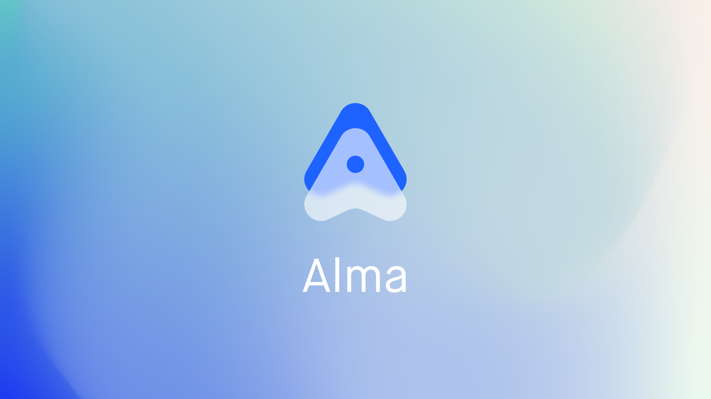

# Alma

Alma is an experimental, interactive playground for generative graphics. It lets you compose nodes to craft WebGL experiences - all through an intuitive no-code interface.

Nominated for "Fun Side Project of the Year" at React Open Source Awards 2023.

[Open Playground](https://alma.sh)

## Packages

Alma is divided up into a bunch of different sub-packages:

### Alma Graph

Core implementation of the Node graph implementation. This was the first implementation of what later became known as the [Nodl framework](https://github.com/emilwidlund/nodl).

### Alma WebGL

The WebGL implementation of Alma. Contains the nodes and compiler which produces the final WebGL program.

### Alma GLSL

A small package which helps with creating custom visual nodes from raw GLSL functions.

### Alma Web

The web application which hosts the client.

## Installation

1. yarn
2. yarn run start
3. Server now up on http://localhost:3000
